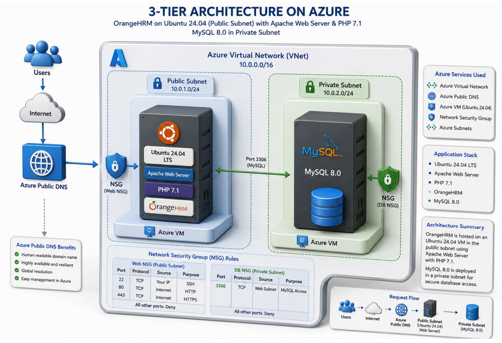

# 3-Tier Web Application Deployment on Microsoft Azure

A production-style, network-isolated 3-tier web application architecture deployed on Microsoft Azure using **Terraform**, running **OrangeHRM** on **Apache + PHP 7.1**, backed by **MySQL 8.0**, with the infrastructure fully segmented across public and private subnets.

---

## Architecture Overview



The application is split into logical tiers across an Azure Virtual Network (`10.0.0.0/16`):

### 1. Presentation & Application Tier (Public Subnet – `10.0.1.0/24`)
- Hosted on an **Ubuntu 24.04 LTS** Azure Virtual Machine.
- Runs **Apache Web Server** and **PHP 7.1**.
- Deployed with **OrangeHRM** for human capital management.
- Protected by a **Web NSG** allowing only:
  - SSH (22) — for management
  - HTTP (80)
  - HTTPS (443)

### 2. Data Tier (Private Subnet – `10.0.2.0/24`)
- Hosted on a separate Azure VM running **MySQL 8.0**.
- Isolated from direct public internet access.
- Protected by a **DB NSG** allowing **MySQL (3306)** strictly from the Web Subnet (`10.0.1.0/24`).

### 3. Networking & Resolution
- **Azure Public DNS** integrated for global, human-readable domain resolution.

**Request flow:** Users → Internet → Azure Public DNS → Public Subnet (Web Server) → Private Subnet (MySQL)

---

## Tech Stack

- **Cloud Provider:** Microsoft Azure
- **Infrastructure as Code:** Terraform (`azurerm` provider, `~> 3.0`)
- **OS:** Ubuntu 24.04 LTS
- **Web Server:** Apache2
- **Language:** PHP 7.1
- **Database:** MySQL 8.0
- **Application:** OrangeHRM
- **Networking:** Azure VNet, Subnets, Network Security Groups (NSGs), Azure Public DNS

---

## Repository Structure

```
.
├── configs/       # Apache & PHP configuration files
├── docs/          # Documentation and diagrams
├── orangehrms/    # OrangeHRM application files
├── scripts/       # Setup/automation scripts
├── terraform/     # Terraform IaC (main.tf)
└── README.md
```

---

## Infrastructure (Terraform)

The infrastructure is defined in `terraform/main.tf` and provisions:

| Resource | Name | Details |
|---|---|---|
| Resource Group | `rg-three-tier-app` | Region: East US |
| Virtual Network | `vnet-three-tier` | `10.0.0.0/16` |
| Public Subnet | `subnet-public-web` | `10.0.1.0/24` — Web/App tier |
| Private Subnet | `subnet-private-db` | `10.0.2.0/24` — Database tier |
| Web NSG | `nsg-web-tier` | Allows SSH(22), HTTP(80), HTTPS(443) from Internet |
| DB NSG | `nsg-db-tier` | Allows MySQL(3306) only from `10.0.1.0/24` |

### Network Security Group Rules

**Web NSG (Public Subnet)**
| Port | Protocol | Source | Purpose |
|------|----------|--------|---------|
| 22 | TCP | Your IP (recommended) | SSH |
| 80 | TCP | Internet | HTTP |
| 443 | TCP | Internet | HTTPS |

All other inbound traffic: **Deny**

**DB NSG (Private Subnet)**
| Port | Protocol | Source | Purpose |
|------|----------|--------|---------|
| 3306 | TCP | Web Subnet (`10.0.1.0/24`) | MySQL access |

All other inbound traffic: **Deny**

> Note: the current `main.tf` SSH rule uses `source_address_prefix = "*"`. For production use, restrict this to your own IP/CIDR rather than allowing all sources.

### Deploying the infrastructure
```bash
cd terraform
terraform init
terraform plan
terraform apply
```

---

## Application Tier Setup (Public Subnet VM)

### 1. Install Apache & PHP 7.1
```bash
sudo apt update
sudo apt install apache2 -y
sudo apt-get install software-properties-common -y
sudo add-apt-repository ppa:ondrej/php -y
sudo apt update
sudo apt install php7.1 php7.1-common php7.1-mbstring php7.1-xmlrpc php7.1-soap \
  php7.1-gd php7.1-xml php7.1-intl php7.1-mysql php7.1-cli php7.1-mcrypt \
  php7.1-ldap php7.1-zip php7.1-curl -y
```

### 2. Apache Virtual Host configuration
Configured to serve OrangeHRM from `/var/www/orangehrm`:
```apache
<VirtualHost *:80>
    ServerAdmin admin@example.com
    DocumentRoot /var/www/orangehrm
    ServerName xyzqwe.xyz
    ServerAlias www.xyzqwe.xyz

    <Directory /var/www/orangehrm/>
        Options +FollowSymlinks
        AllowOverride All
        Require all granted
    </Directory>

    ErrorLog ${APACHE_LOG_DIR}/error.log
    CustomLog ${APACHE_LOG_DIR}/access.log combined
</VirtualHost>
```

### 3. PHP configuration
Key settings applied in `php.ini`:
```ini
file_uploads = On
allow_url_fopen = On
memory_limit = 256M
upload_max_filesize = 100M
date.timezone = America/Chicago
```

---

## Data Tier Setup (Private Subnet VM)

- MySQL 8.0 installed on a dedicated VM in the private subnet.
- Not directly reachable from the internet — only accessible on port `3306` from the web subnet, as enforced by the DB NSG.
- OrangeHRM's database connection is configured to point to this VM's private IP.

---

## Notes / Possible Improvements

- Restrict the Web NSG's SSH rule to a specific IP/CIDR instead of `*`.
- Move sensitive values (DB credentials, admin email, domain name) into Terraform variables / a `.tfvars` file instead of hardcoding them in configs.
- Add a Terraform remote backend (e.g. Azure Storage) for state management instead of local state.
- Consider adding an Azure Load Balancer or Application Gateway in front of the web tier for high availability.
- Enable HTTPS properly (e.g. via Let's Encrypt/Certbot) since port 443 is opened but no TLS setup is documented yet.
- Add outbound rules / explicit deny-all as needed — current NSGs only define inbound allow rules.
